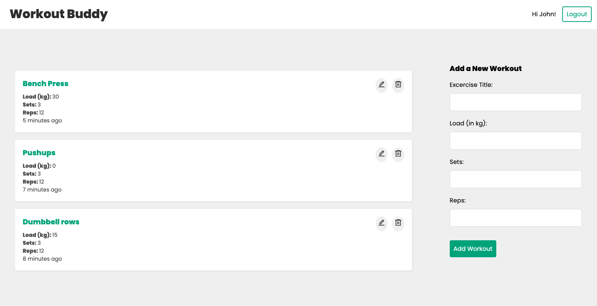

# Workout Buddy

Live demo: https://workoutbuddy.netlify.app

This is a responsive MERN stack web application that has several functionalities below:

- User signup, login and logout
- User authentication
- User can get, create, update and delete workouts

Pre-made account is below:

email: test@gmail.com

password: chicken

# Screenshot

# Frontend

- React Hooks, Context API and Reducer
- React Router v6
- React Icons
- CSS Modules

# Backend

- Node
- Express

# Database

- MongoDB
